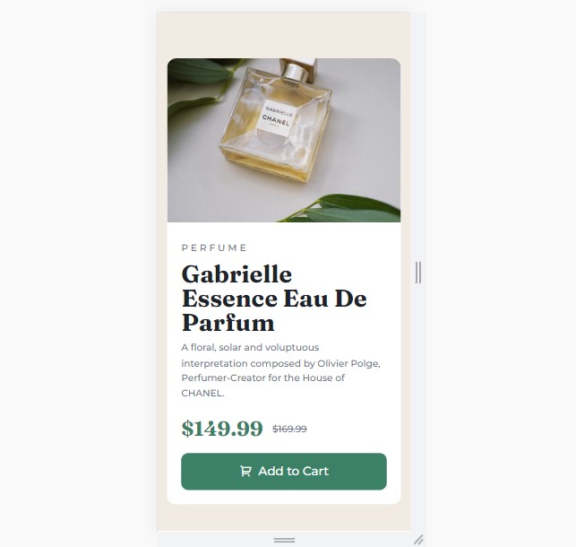
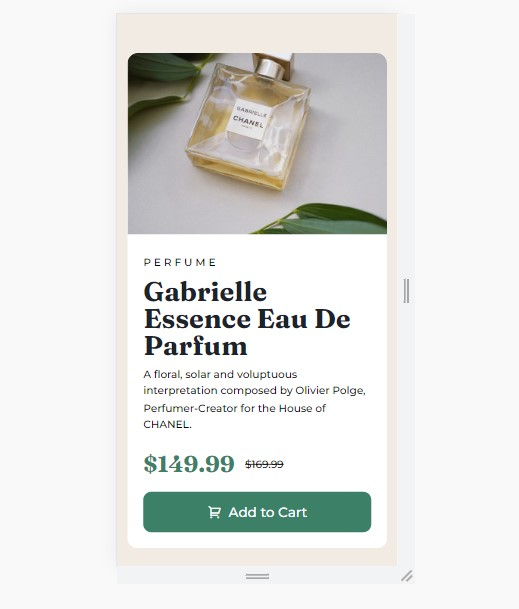

# Frontend Mentor - Product preview card component solution

This is a solution to the [Product preview card component challenge on Frontend Mentor](https://www.frontendmentor.io/challenges/product-preview-card-component-GO7UmttRfa). Frontend Mentor challenges help you improve your coding skills by building realistic projects. 

## Table of contents

  - [The challenge](#the-challenge)
  - [Screenshot](#screenshot)
  - [Links](#links)
  - [My process](#my-process)
  - [What I learned](#what-i-learned)
  - [Built with](#built-with)
  - [Author](#author)


### The challenge

Your challenge is to build out this product preview card component and get it looking as close to the design as possible.

You can use any tools you like to help you complete the challenge. So if you've got something you'd like to practice, feel free to give it a go.

Users should be able to:

- View the optimal layout depending on their device's screen size
- See hover and focus states for interactive elements

### Screenshot




  <!--  -->

### Links

- Solution URL: [https://github.com/Rgeb1/frontend-mentor-product-preview-card-component.git]
- Live Site URL: [https://www.frontendmentor.io/solutions/product-preview-card-using-grid-and-flexbox-mobile-first-approach-7peax_9yB-]


## My process

I started styling this project using the mobile first approach, I find it a lot easier this way. I then used media queries to do the layout for the desktop.


### What I learned

 I learned that you could change an image seemlessly by using the picture syntax and a media query.

```html
<picture class="product-img">
          <source srcset="images/image-product-desktop.jpg" media="(min-width: 600px)">
          
        </picture>
```


### Built with

- Semantic HTML5 markup
- CSS custom properties
- Flexbox
- CSS Grid
- Mobile-first workflow


## Author

- Frontend Mentor - [@Rgeb1](https://www.frontendmentor.io/profile/yourusername)
